# Shabakat

<p align="center">
  
</p>

<p align="center">
  <b>Windows desktop billing for private electricity networks</b><br/>
  Ampere · Kilowatt · Fixed Kilowatt · meters · invoices · payments · English / Arabic
</p>

<p align="center">
  <a href="https://dotnet.microsoft.com/"></a>
  <a href="https://learn.microsoft.com/dotnet/maui/"></a>
  <a href="https://dotnet.microsoft.com/apps/aspnet/web-apps/blazor"></a>
  <a href="https://tailwindcss.com/"></a>
  <a href="https://learn.microsoft.com/ef/core/"></a>
  <a href="https://www.sqlite.org/"></a>
  <a href="https://www.microsoft.com/windows"></a>
  <a href="https://www.cloudflare.com/"></a>
  
  
</p>

---

## Table of contents

- [Screenshots](#screenshots)
- [About](#about)
- [Built with](#built-with)
- [Features](#features)
  - [Dashboard](#dashboard)
  - [Fuel market](#fuel-market)
  - [Network topology](#network-topology)
  - [Subscribers](#subscribers)
  - [Invoices & billing](#invoices--billing)
  - [Calculator](#calculator)
  - [Expenses](#expenses)
  - [Audit logs](#audit-logs)
  - [Settings](#settings)
  - [Activation & security](#activation--security)
  - [Plan types](#plan-types)
- [Tech stack](#tech-stack)
- [Project layout](#project-layout)
- [Requirements](#requirements)
- [Getting started](#getting-started)
- [Release (MSI)](#release-msi)
- [Localization](#localization)
- [Documentation](#documentation)
- [License note](#license-note)

---

## Screenshots

Placeholder PNGs in [`wwwroot/images/screenshots/`](wwwroot/images/screenshots/). Replace each file with a real capture when ready.

Pending captures are tracked with `.png.txt` markers. Add real [`fuel-market-lebanon.png`](wwwroot/images/screenshots/fuel-market-lebanon.png.txt) and [`fuel-market-global.png`](wwwroot/images/screenshots/fuel-market-global.png.txt) captures, then refresh [`dashboard.png`](wwwroot/images/screenshots/dashboard.png.txt) and [`invoices.png`](wwwroot/images/screenshots/invoices.png.txt) for the latest UI.

<table>
  <tr>
    <td align="center" width="33%">
      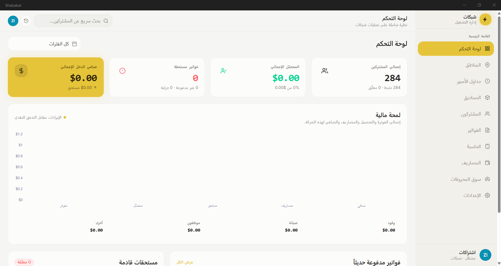<br/>
      <strong>Dashboard</strong>
    </td>
    <td align="center" width="33%">
      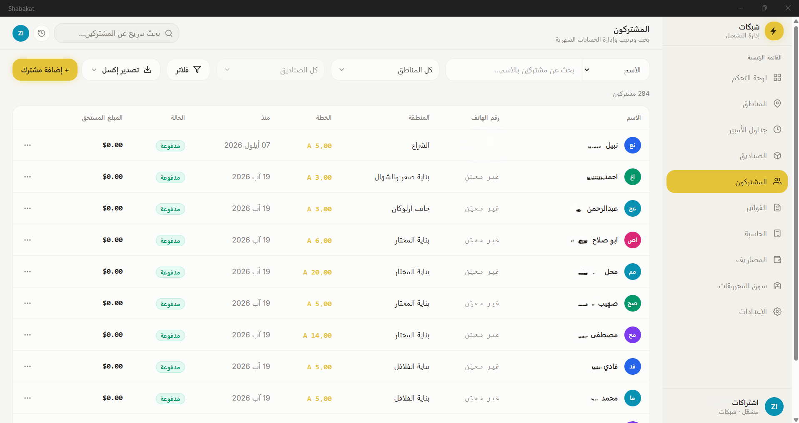<br/>
      <strong>Subscribers</strong>
    </td>
    <td align="center" width="33%">
      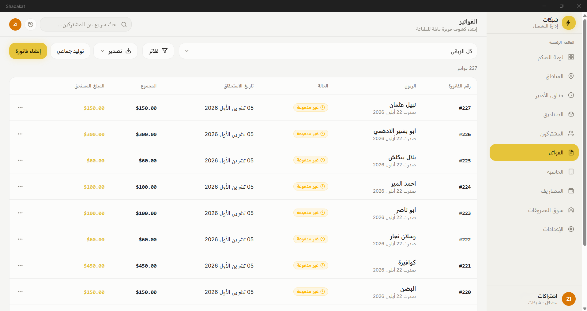<br/>
      <strong>Invoices</strong>
    </td>
  </tr>
  <tr>
    <td align="center" width="33%">
      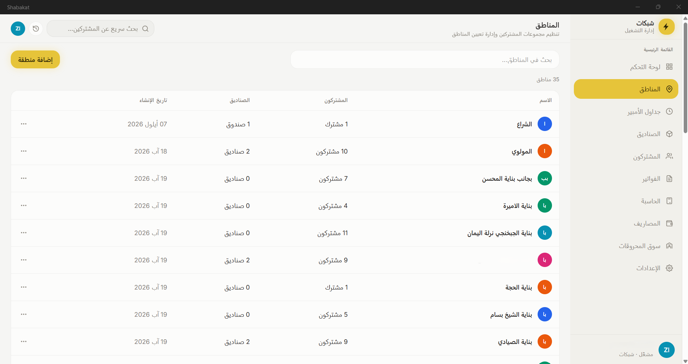<br/>
      <strong>Areas</strong>
    </td>
    <td align="center" width="33%">
      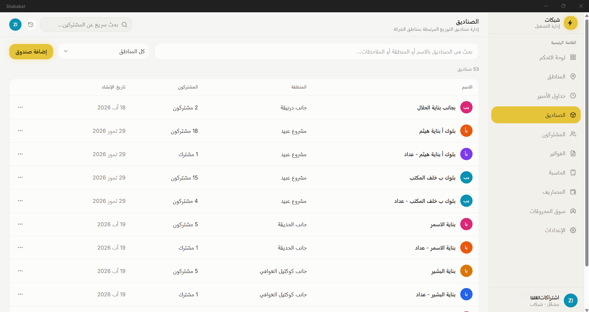<br/>
      <strong>Boxes</strong>
    </td>
    <td align="center" width="33%">
      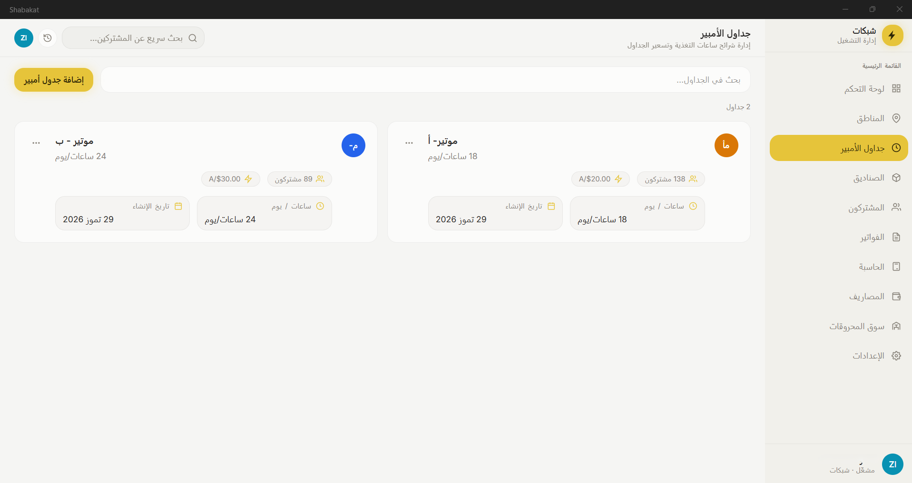<br/>
      <strong>Ampere schedules</strong>
    </td>
  </tr>
  <tr>
    <td align="center" width="33%">
      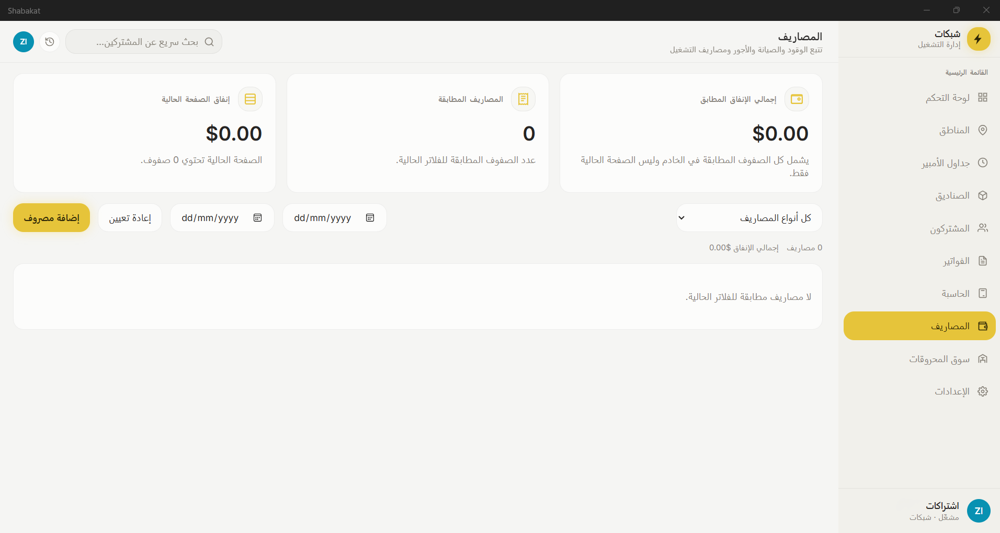<br/>
      <strong>Expenses</strong>
    </td>
    <td align="center" width="33%">
      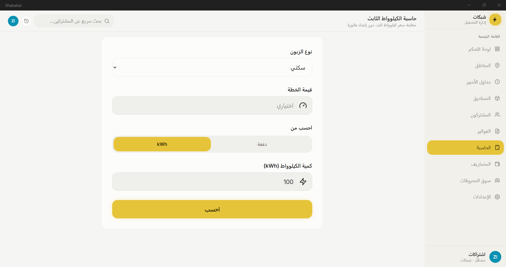<br/>
      <strong>Calculator</strong>
    </td>
    <td align="center" width="33%">
      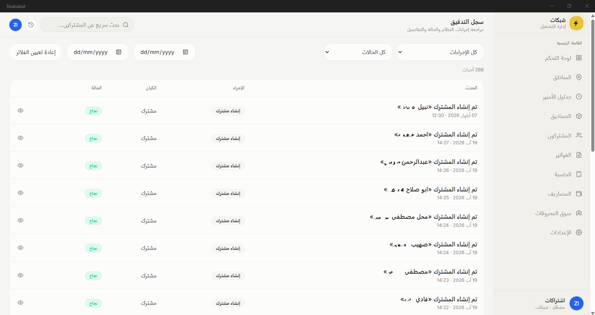<br/>
      <strong>Audit logs</strong>
    </td>
  </tr>
  <tr>
    <td align="center" width="33%">
      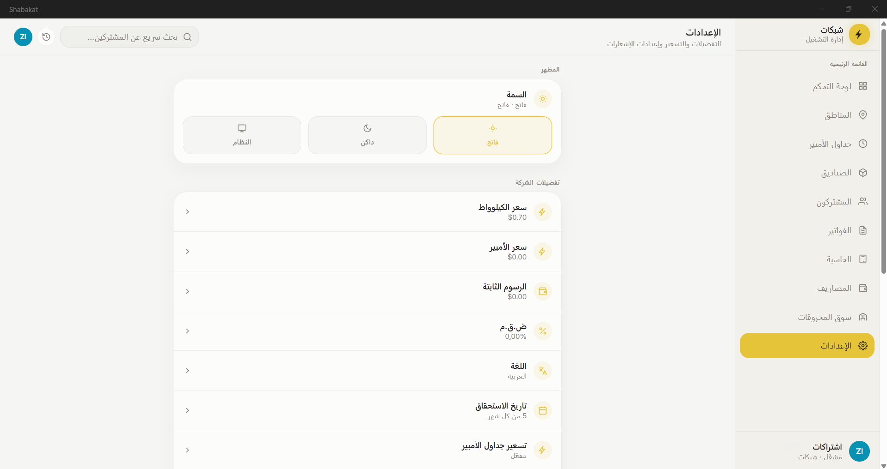<br/>
      <strong>Settings</strong>
    </td>
    <td align="center" width="33%">
      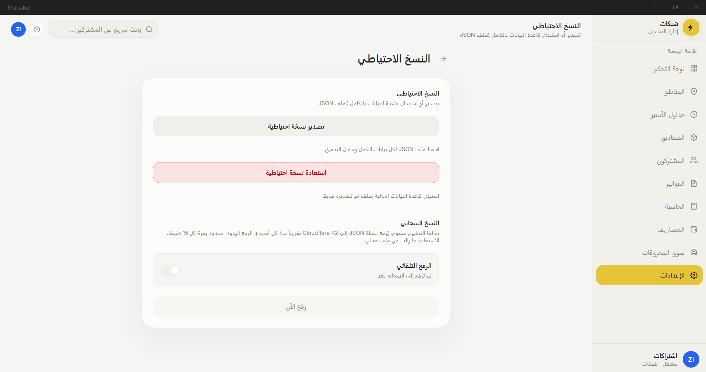<br/>
      <strong>Backup</strong>
    </td>
    <td align="center" width="33%">
      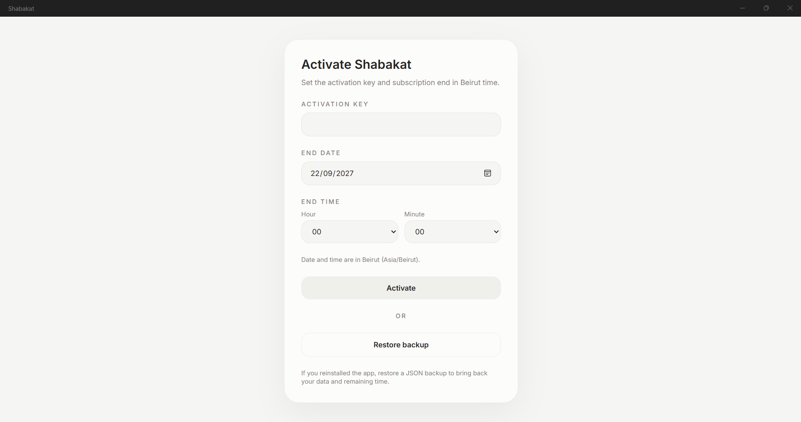<br/>
      <strong>Activation</strong>
    </td>
  </tr>
</table>

---

## About

**Shabakat** is a **Windows-only** .NET MAUI Blazor Hybrid app for neighborhood / private-grid electricity operators (Lebanon-style workflows).

Operators manage subscribers, meter readings, monthly billing runs, payments, areas and distribution boxes, ampere schedules, expenses, and company settings — all offline on **SQLite**, with optional **cloud JSON backup upload**, bilingual **English / Arabic (RTL)** UI, and HTML invoice print / multi-page PDF export.

Live fuel-market panels use the internet when available without affecting offline billing workflows.

---

## Built with

What the product actually runs on and why:

| Technology | Role in Shabakat |
|---|---|
| **.NET 10** | Single-project Windows desktop runtime (`net10.0-windows10.0.19041.0`) |
| **.NET MAUI** | Native Windows shell, packaging, fonts, icons, splash, AppData paths |
| **Blazor Hybrid** (`BlazorWebView`) | All screens are Razor components inside a WebView2 host — not native XAML pages |
| **Tailwind CSS v4** | Entire UI styling via `Styles/app.css` → `wwwroot/app.css` (no scoped `.razor.css`) |
| **Entity Framework Core 10** | ORM, migrations, change tracking |
| **SQLite** | Local offline database (per-install AppData) |
| **ClosedXML** | Subscriber Excel export |
| **Microsoft.Extensions.Localization** | `en` / `ar` `.resx` strings |
| **Microsoft.Extensions.Identity.Core** | PIN hashing for activation |
| **Microsoft.Extensions.Http** | Cloud backup HTTP client |
| **Chart.js** | Dashboard revenue and fuel-market charts (`wwwroot/js`) |
| **HTML invoice templates** | `invoice.html` / `invoice.ar.html` + Noto Sans Arabic fonts |
| **Microsoft Edge (headless)** | Billing-run multi-page PDF (`--print-to-pdf`) from the same HTML |
| **WebView2 print** | Single-invoice print dialog (`shabakatPrintHtml`) |
| **WiX Toolset** | Per-machine MSI installer |
| **Cloudflare Workers + R2** | Optional upload-only JSON backups |
| **Wrangler** | Deploy / preview the backup worker |

### NuGet & npm (main)

| Package | Version / note |
|---|---|
| `Microsoft.EntityFrameworkCore` (+ Sqlite, Design, Tools) | 10.0.x |
| `Microsoft.Maui.Controls` | `$(MauiVersion)` |
| `Microsoft.AspNetCore.Components.WebView.Maui` | Blazor Hybrid host |
| `ClosedXML` | 0.105.x |
| `Microsoft.Extensions.Identity.Core` | PIN hashing |
| `Microsoft.Extensions.Localization` | i18n |
| `Microsoft.Maui.DevFlow.Agent` / `Blazor` | DEBUG UI inspection (preview) |
| `tailwindcss` + `@tailwindcss/cli` | v4.3.x (npm) |
| `wrangler` | Cloudflare worker deploy (npm) |

### Architecture choices

- **Clean-ish layers**: `Domain` → `Application` (services/DTOs) → `Infrastructure` (EF/repos) + thin Blazor UI
- **Windows-only TFM** — no Android / iOS / Mac targets
- **Offline-first** SQLite; cloud backup and fuel-market data are optional online features
- **One print pipeline** for single print and month PDF (same templates + Settings language)
- **Light / dark / system** themes via `data-theme` + Tailwind

---

## Features

### Dashboard

- Period filter (all-time or month)
- Metrics: total subscribers, collected, outstanding invoices, net income
- Revenue chart
- Recent payments and upcoming due panels
- Fuel-market preview for Brent, WTI, Lebanon 95-octane gasoline, and diesel

### Fuel market

- Lebanon-first switcher with a simple transition between Lebanon and global markets
- Lebanon 95/98-octane gasoline, diesel, and LPG prices and history from IPT Group
- Global WTI, Brent, natural gas, RBOB gasoline, and heating-oil prices from Yahoo Finance
- 1-month, 3-month, and 1-year chart ranges with accessible, latest-first data tables
- Manual refresh, connectivity-aware errors, and stale cached-data fallback
- No API key required; market data is informational, source-dependent, and may be delayed

### Network topology

| Page | Capabilities |
|---|---|
| **Areas** | Create / edit / delete geographic areas; details sheet |
| **Boxes** | Distribution boxes linked to areas |
| **Ampere schedules** | Hour-tier supply schedules and schedule pricing for Ampere customers |

### Subscribers

- Full CRUD for customers
- Plan assignment: Ampere, Kilowatt, Fixed Kilowatt
- Customer type (residential / commercial / industrial) and pricing overrides
- Link to area, box, ampere schedule, cable / building / floor
- Status: active, suspended, terminated
- Suspend / resume flows
- Meter readings: add initial and period readings, delete readings
- Search and filters
- Excel export of subscribers (column preferences in Settings)

### Invoices & billing

- Create single invoice (Ampere / Kilowatt / Fixed Kilowatt rules)
- Pay invoices (full / partial); unpaid / partially paid / paid statuses
- Invoice details, payment history, edit / delete (with guards)
- Filters: customer, status, issue-date range
- Payment due dates shown consistently in invoice lists, details, and printed output using the configured due day
- **Bulk generate** for eligible Ampere + Kilowatt customers (Fixed Kilowatt excluded)
  - Day 1–2: Kilowatt bills **previous** calendar month; Ampere bills current period from today
  - From day 25: optional next-month Ampere catch-up
- **Billing-run month PDF export**: one multi-page PDF with three invoices per portrait A4 page
  - Ampere invoices for selected month + Kilowatt for previous month
  - Optional area filter, followed by an optional box filter scoped to that area
  - Same HTML templates as single print (`invoice.html` / `invoice.ar.html`)
  - Language from Settings
- Single-invoice print (HTML → system print dialog)
- Skipped bulk customers with reasons (view after bulk run)
- Invoice skip records for missing meter readings / duplicates

### Calculator

- Fixed Kilowatt payment ↔ kWh credit preview using current pricing

### Expenses

- Create / edit / delete operator expenses
- Summary cards and list with details

### Audit logs

- Success / failure trail of operator actions
- Filters and detail sheet (what changed)

### Settings

| Setting | What it controls |
|---|---|
| **Language** | `en` / `ar` (RTL); drives UI + invoice templates |
| **Pricing** | Price per amp, price per kWh, fixed charge, TVA; per customer-type rates |
| **Due date** | Preferred payment due day shown in invoice lists, details, and printed output |
| **Ampere schedule pricing** | Enable / disable schedule-based Ampere rates |
| **Ampere proration** | Bill Ampere by days in month |
| **Company logo** | Logo on printed invoices |
| **Excel export** | Which subscriber columns to export |
| **Backup** | Local JSON export / restore (replace-all); optional cloud upload to R2 |
| **WhatsApp** | Offline / stub messaging settings |
| **Testing** | Dev helpers (e.g. Lebanon demo seed) |
| **Theme** | Light / dark UI |

### Activation & security

- License gate before the main app
- PIN unlock
- License expiry evaluated in **Asia/Beirut**
- Restore backup from the activation screen when needed

### Plan types

| Plan | How billing works |
|---|---|
| **Ampere** | Amperage subscription; optional schedule pricing and day proration |
| **Kilowatt** | Metered consumption (current − previous reading); day 1–2 bulk uses previous month |
| **FixedKilowatt** | Prepaid-style energy credits from a payment amount; **not** in bulk create or billing-run PDF export |

---

## Tech stack

| Layer | Choice |
|---|---|
| Runtime | .NET 10 · `net10.0-windows10.0.19041.0` only · Windows App SDK self-contained |
| App shell | MAUI + Blazor Hybrid (WebView2) |
| UI | Blazor Razor components · Tailwind CSS v4 · light/dark/system |
| Data | EF Core 10 · SQLite · code-first migrations |
| Charts | Chart.js |
| Invoices | HTML templates → Edge headless PDF / WebView2 print |
| Excel | ClosedXML |
| Security | Identity password hasher (PIN) · license gate · Beirut timezone |
| Installer | WiX MSI (`Installer/`, `pack-msi.ps1`) |
| Cloud backup | Cloudflare Worker + R2 (`cloudflare/backup-worker/`) |
| Market data | Yahoo Finance + IPT Group, cached locally in AppData |
| Localization | `.resx` en + ar · RTL for Arabic |
| CI | GitHub Actions Windows build (`.github/workflows/`) |

---

## Project layout

```
Shabakat/
├── Application/       # Services, DTOs, contracts, helpers, backup
├── Domain/            # Entities, enums, exceptions
├── Infrastructure/    # EF, repositories, invoice Templates/
├── Components/        # Blazor Features / Layout / Shared
├── Platforms/         # Windows
├── Resources/         # Icons, splash, localization
├── Styles/            # Tailwind input (app.css)
├── wwwroot/           # Built CSS, JS, logo, screenshots
├── Installer/         # MSI packaging
├── cloudflare/        # Backup worker
└── docs/              # Ops & feature docs
```

Layers: **Domain** ← **Application** ← **Infrastructure** / **Components** (UI stays thin).

---

## Requirements

| Tool | Purpose |
|---|---|
| Windows 10 / 11 | Only supported platform |
| .NET 10 SDK | Build and run |
| MAUI workload `maui-windows` | Windows target |
| Node.js / npm | Tailwind (`npm run tw:build`) |
| Microsoft Edge | Headless billing-run PDF generation |
| Internet connection | Optional; needed only for live fuel prices and cloud backup |

---

## Getting started

```powershell
npm ci
npm run tw:build
dotnet build
dotnet run --project Shabakat.csproj
```

Watch CSS while developing:

```powershell
npm run tw:watch
```

> Debug AppData is not the same as MSI AppData. Move data with **Settings → Backup** JSON if needed.

Market data needs no API key. Successful responses are cached at `FileSystem.AppDataDirectory/market-prices-cache-v1.json` for offline fallback. Default freshness is 5 minutes globally and 30 minutes for Lebanon.

---

## Release (MSI)

Output: `Installer\bin\Release\Shabakat.msi`

```powershell
.\pack-msi.ps1
```

Bump these together (details in [`docs/release.md`](docs/release.md)):

| Place | Property |
|---|---|
| `Shabakat.csproj` | `ApplicationDisplayVersion`, `ApplicationVersion` |
| `Installer/Package.wxs` | `Package Version` |

Installs per-machine to `C:\Program Files\Shabakat`. SQLite, license, and logos live under the user’s AppData.

---

## Localization

| Language | Resource file |
|---|---|
| English | [`Resources/Localization/SharedResource.resx`](Resources/Localization/SharedResource.resx) |
| Arabic (RTL) | [`Resources/Localization/SharedResource.ar.resx`](Resources/Localization/SharedResource.ar.resx) |

Preference `Language` is `en` or `ar`. Invoice print picks `invoice.html` or `invoice.ar.html` accordingly.

---

## Documentation

| Doc | Topic |
|---|---|
| [`docs/billing-run-invoices.md`](docs/billing-run-invoices.md) | Bulk create + billing-run PDF (incl. SaaS port notes) |
| [`docs/backup.md`](docs/backup.md) | JSON backup schema, restore, cloud upload |
| [`docs/market-data.md`](docs/market-data.md) | Fuel-market sources, caching, and connectivity behavior |
| [`docs/release.md`](docs/release.md) | MSI versioning and packaging |
| [`cloudflare/backup-worker/README.md`](cloudflare/backup-worker/README.md) | R2 backup worker |

---

## License note

The shipped app is gated by PIN + license activation. This repository’s open-source license (if any) is separate from the product license key flow.
